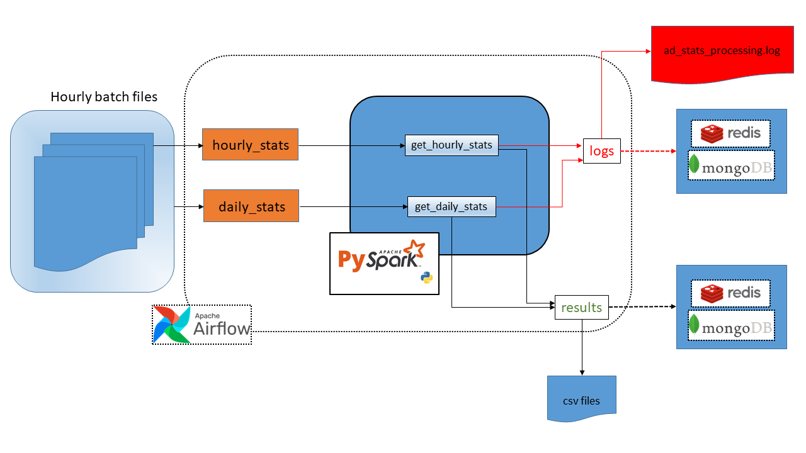

# Website ad data processing

<!-- TOC -->
- [Website ad data processing](#website-ad-data-processing)
    - [Overview](#overview)
        - [Goals](#goals)
    - [Event processing: architecture design & features](#event-processing-architecture-design--features)
        - [Job set up and scheduling](#job-set-up-and-scheduling)
        - [Data processing](#data-processing)
            - [Settings](#settings)
            - [Results](#results)
            - [Logs](#logs)
    - [Environment set up](#environment-set-up)
        - [Install in conda env](#install-in-conda-env)
        - [Install in venv](#install-in-venv)
    - [Run the services](#run-the-services)
        - [Generate sample data](#generate-sample-data)
            - [About user_ids](#about-user_ids)
        - [Compute hourly statistics](#compute-hourly-statistics)
        - [Compute daily statistics](#compute-daily-statistics)
    - [Further developments](#further-developments)
        - [Scaling Spark](#scaling-spark)
        - [Data QC](#data-qc)
        - [Scheduling](#scheduling)
        - [Real-time streaming processing](#real-time-streaming-processing)

<!-- /TOC -->

### Goals

- Set up a service that will receive and process data related to views and clicks of website ads.  
- Compute hourly and daily statistics for each placement_id (number of views and clicks of each placement_id).
- Count distinct users which viewed or clicked on a placement.
- Compute the same statistics above (number of views, clicks and distinct users) for each page.

## Event processing: architecture design & features


_Workflow of the message processing. Services in dotted frames have not been implemented yet, but are discussed in this document (see [Further developments](#Furtherdevelopments))._

### Job set up and scheduling

The infrastructure has been designed in the scenario of receiving hourly batches of data. The system is scheduled to receive a new file at each round hour, with the following naming template: `YYYY-MM-DD_hh-00-00_sample_data.csv` (for testing purposes, the files are located in the folder `data/sample_data`). Therefore, the architecture for processing these batch files includes two jobs:

- a **hourly** processing to get hourly statistics
- a **daily** processing to get daily statistics.

Upon successful completion of the the daily processing, the related batch files could be removed, based on storage needs.

### Data processing

#### Settings

The core data processing (filtering/aggregation) is implemented in PySpark, in order to leverage on the reliability and scalability of this framework. Special attention is required in the allocation of computational resources. Preliminary tests performed on a Ubuntu/WSL2 laptop (16 cores/16GB RAM) have shown that a setting of 1M events/hr distributed across 50K users / 10 banners / 20 pages is handled by the system quite seamlessly. For the daily stats computation, 2 cores were allocated to the SparkSession builder.

**Enforce a schema when reading the batch file.** This has been implemented for both jobs.

#### Results

The dataframe output by the hourly processing has the following fields:

- **placement_id** or **page_id**, depending on the chosen field to aggregate by
- **start_time** in UTC format
- **end_time** in UTC format
- **number of hourly views** for a placement_id or page_id
- **number of hourly clicks** for a placement_id or page_id
- **number of distinct users** for a placement_id or page_id.

The dataframe output by the daily processing has the following fields:

- **placement_id** or **page_id**, depending on the chosen field to aggregate by
- **date**
- **number of daily views** for a placement_id or page_id
- **number of daily clicks** for a placement_id or page_id
- **number of distinct users** for a placement_id or page_id.

Processing results are saved in the folder structure `data/stats/<batch_type>/<grouping_id>` for further use.

#### Logs

Logs are an essential feature of the data ingestion pipeline. Two loggers have been configured:

 - **console_logger** that prints messages on the screen (Pyspark console messages will be printed on screen as well)
 - **db_logger** that stores logging messages in jsonl format, then appends the logged events to a logfile (`data/logs/ad_stats_processing.log`). To this purpose, a custom Python class (`DbLogger`) has been developed, with the following attributes:
   - **status** reporting task status (_eg_ `SUCCESS`, `FAILED`) or progress (`INFO`, `WARNING`);
   - **message** _eg_ `Daily report for 2024-01-24: DONE`
   - **log_timestamp**: the timestamp (UTC) of the _logged event_
   - **batch_type**: the aggregation level of the job (`daily` or `hourly`)
   - **grouping_field**: the field used in the job to aggregate data
   - **batch_timestamp**: the timestamp (UTC) of the batch whose processing generated the logging message, rounded to the beginning of the reported hour for hourly processing (_eg_ `2024-01-24T18:55:29` becomes `2024-01-24T18:00:00`) or to the beginning of the reported day for daily processing (_eg_ `2024-01-24T18:55:29` becomes `2024-01-24T00:00:00`).

Besides the `SUCCESS`/`FAILED` messages output when a job is over, some `WARNING` logs can be issued, _eg_ logs reporting that the daily job did not find the expected number of files to be processed (n=24).  

More attributes could be added. Regardless, the jsonl file can be used to produce the logs to a dedicated database.

Further details and possible developments of the architecture are discussed in the section [Further developments](#Furtherdevelopments).

## Environment set up

If you already have a working Java installation, you can skip to the [next section](#install-in-venv) to install the requirements in a venv

### Install in conda env

```bash
# create conda env with python==3.10 and activate environment
conda create -n website_traffic_analysis python=3.10
conda activate website_traffic_analysis
```

If you don't have java installed on your machine, please install it within the created conda env:

```bash
conda install -c conda-forge openjdk
```

Install requirements

```bash
pip install -r requirements.txt
```

### Install in venv

Install pip requirements

```bash
# create venv and install requirements
python -m venv website_traffic_analysis
source website_traffic_analysis/bin/activate

pip install -r requirements.txt
```

## Run the services

### Generate sample data

Generation of sample data is performed with the script `utils/generate_sample_data.py`. Simulated batches of data will be written as csv files in `data/sample_data`.  

Parameters for this script can be set in two ways:

- through a configuration file (in YAML format: please refer to the `conf.yaml` file in the root directory for an example) provided with the `-c` (`--conf-file`) option
- through the command line options (which will overseed the conf file provided with `-c`), as follows: 

```
usage: generate_sample_data.py [-h] [-c CONF_FILE] [-e N_EVENTS] [-b N_BANNERS] [-p N_PAGES] [-u N_USERS]

Generate a daily equivalent (24 batches) of hourly website traffic data.

options:
  -h, --help            show this help message and exit
  -c CONF_FILE, --conf-file CONF_FILE
                        YAML configuration file. Please note: if other options are provided, they will overseed the ones provided by the YAML file.
  -e N_EVENTS, --n-events N_EVENTS
                        Number of events to be generated (default: 100000)
  -b N_BANNERS, --n-banners N_BANNERS
                        Number of banners to be generated (default: 10)
  -p N_PAGES, --n-pages N_PAGES
                        Number of pages to be generated (default: 100)
  -u N_USERS, --n-users N_USERS
                        Number of user_ids to be generated (default: 50000)
```

Please note that number of placements to be generated can not be provided as option since it is set by design (n=5).

```bash
python utils/generate_sample_data.py -c conf.yaml
```

#### About user_ids

The user_id list is computed **before** running the generation of all batch files in order to keep user_ids consistent across generated batches. 

### Compute hourly statistics

This job script will compute hourly stats for a single file (by default, `data/sample_data/2024-01-24_00-00-00_sample_data.csv`). Required parameters are the name of the batch file to be processed (`-i`) and the field used for aggregation (`-g`, either `placement_id` or `page_id`). Full list of options, available through the command `python hourly_stats.py --help`, is provided as follows:

```
usage: hourly_stats.py [-h] -i INPUT [-g {placement_id,page_id}] [-t {yesterday,today,tomorrow}]

Compute stats for an hourly event batch file.

options:
  -h, --help            show this help message and exit
  -i INPUT, --input INPUT
                        Event batch input file (default: None)
  -g {placement_id,page_id}, --grouping-field {placement_id,page_id}
                        Event table field to compute statistics for
  -t {yesterday,today,tomorrow}, --log-timestamp {yesterday,today,tomorrow}
                        Date to use in logging (for testing purposes). Timezone: UTC
```

An example of processing of a batch data file aggregating by placement_id

```bash
python hourly_stats.py -g placement_id -i data/sample_data/2024-01-24_00-00-00_sample_data.csv
```

Logs will be written to file `data/logs/ad_stats_processing.log` and printed on console.

### Compute daily statistics

This job script will compute daily stats, using the 24 batch files available in the folder `data/sample_data`. The only required parameter is the field used for aggregation (`-g`, either `placement_id` or `page_id`). Full list of options, available through the command `python daily_stats.py --help`, is provided as follows:

```
usage: daily_stats.py [-h] [-i INPUT_FOLDER] [-g {placement_id,page_id}] [-t {yesterday,today,tomorrow}]

Compute stats for a daily equivalent of batch files.

options:
  -h, --help            show this help message and exit
  -i INPUT_FOLDER, --input-folder INPUT_FOLDER
                        Folder with event batch input files (default: data/sample_data/)
  -g {placement_id,page_id}, --grouping-field {placement_id,page_id}
                        Event table field to compute statistics for
  -t {yesterday,today,tomorrow}, --log-timestamp {yesterday,today,tomorrow}
                        Date to use in logging (for testing purposes). Timezone: UTC
```

An example of processing of a batch data file aggregating by page_id

```bash
python daily_stats.py -g page_id
```

Logs will be written to file `data/logs/ad_stats_processing.log` and printed on console.

## Further developments

### Scaling Spark

This processing service has proven to be fast and reliable, with the capability of processing hourly batches of 1M events. Since the website for which the service has been designed is a very busy website, in production deployments we might need to scale horizontally and allocate more resources to the Spark instance.

### Data QC

Some events might harbor missing values for certain fields due to some upstream issue. If the missing fields are `user_id` and/or the field for which we are collecting statistics (`placement_id` or `page_id` depending on the task), such events should be carefully handled, with the option of filtering them out, with a report of event survival rate _eg_ in the stats table or in the log file.

### Scheduling

In the examples provided in this repository, a daily equivalent of hourly batches (n=24) is simulated in a single run. In a real life scenario, one batch file per hour will be provided. These batch files should be processed with the logic implemented in the `hourly_stats.py` script as soon as they are received, while the logic implemented in the script `daily_stats.py` should be scheduled to run every 24 hours. If the whole procedure succeeds, the whole daily dataset could be deleted for storage purposes.

Scheduling of the hourly_stats job should find a tradeoff between providing the statistics in a timely fashion (_ie_, as soon as the batch file is _supposed_ to be collected) and ensuring the batch file is actually available, since there might be delays in the batch file delivery. An Airflow DAG could be triggered 5 seconds after the beginning of the hour, with a maximum of 10 retries scheduled every 15 seconds.

Scheduling of the daily_stats job should find the above mentioned tradeoff too, with the additional consideration that the job is expected to find 24 batch files to be processed as once. Triggering of this job should be dependent upon this check, therefore we could implement a retry strategy of 10 retries scheduled every 15 seconds, starting from 5-10 seconds after midnight. However, the job is scheduled to run in any case, with the logging of the number of expected missing files. 

### Real-time streaming processing

A processing setting relying on real-time streaming (RTS) is not provided here. However, RTS is a quite common scenario for the processing of website traffic data, therefore it is worth discussing some relevant aspects of this kind of setup which would set it apart from the batch system implemented in this project.

For a RTS-based processing service, we could leverage on Apache Kafka, which is well integrated with the Spark API. More in detail, we would create and incrementally populate a `spark.readStream` (a special spark data frame which can subscribe to specific Kafka topics) which would be used to compute the required statistics in real time. A potential pitfall related to RTS is the potential delay or loss of data. In this perspective, it is worth mentioning that the service could be implemented as a hybrid structure such as a lambda architecture, which processes both RTS and batch data with the ultimate aim of providing a comprehensive and fault-tolerant processing system.